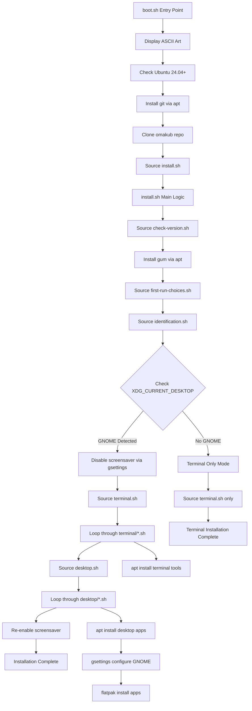
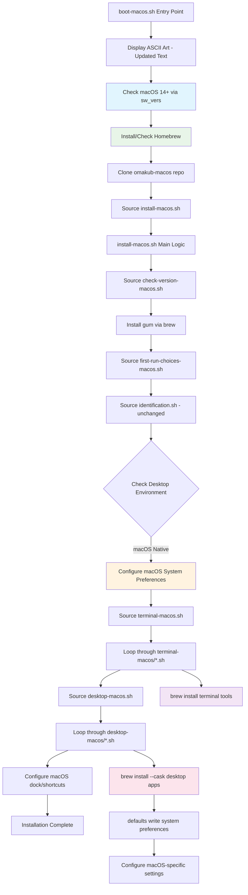

# CLAUDE.md

This file provides guidance to Claude Code (claude.ai/code) when working with code in this repository.

## macOS Adaptation

This repository has been adapted to support macOS alongside Ubuntu. The macOS version maintains the same philosophy and structure while using macOS-native tools and conventions.

### macOS Entry Points

- `bash <(curl -s https://github.com/lsroot/omakub-m/raw/master/boot-macos.sh)` - Bootstrap macOS installation
- `source ~/.local/share/omakub-macos/install-macos.sh` - Main macOS installation script
- `source ~/.local/share/omakub-macos/boot-macos.sh` - macOS entry point

### macOS Structure

- `boot-macos.sh` - macOS entry point with Homebrew setup
- `install-macos.sh` - Main macOS orchestrator
- `install/terminal-macos/` - macOS terminal applications using Homebrew
- `install/desktop-macos/` - macOS desktop applications using Homebrew Cask
- `install/desktop-macos/optional/` - Optional macOS desktop applications (22 apps)
- `defaults/zsh/` - Zsh configuration (replacing bash for macOS)

### Key macOS Differences

- **Package Manager**: Homebrew instead of APT
- **Shell**: Zsh instead of Bash (macOS default since Catalina)
- **System Preferences**: `defaults` commands instead of `gsettings`
- **Application Installation**: Homebrew Cask instead of Flatpak/Snap
- **Path Structure**: macOS-specific paths for configurations and applications

### macOS Optional Apps (22 Total)

Direct mappings: 1Password, Spotify, OBS Studio, Brave, GIMP, Steam, Zoom, Audacity, Dropbox, Minecraft, VirtualBox, Cursor, Zed, Windsurf, RubyMine, RetroArch, Parallels Desktop, Doom Emacs

Alternative solutions: Web apps (Safari/Chrome shortcuts), Windows VM setup guidance

Info-only scripts: ASD Control, Mainline Kernels (Linux-specific, not applicable)

## Key Commands

### Installation and Setup

- `bash <(curl -s https://omakub.org/install)` - Bootstrap installation from web
- `source ~/.local/share/omakub/install.sh` - Main installation script
- `source ~/.local/share/omakub/boot.sh` - Entry point that clones repo and starts install

### Management via omakub CLI

The main command interface is through the `omakub` binary located at `bin/omakub`:

- `omakub` - Interactive menu with Theme, Font, Update, Install, Uninstall, Manual options
- `omakub theme` - Change system theme
- `omakub font` - Change terminal font
- `omakub update` - Update Omakub to latest version
- `omakub install` - Reinstall or install additional components
- `omakub uninstall` - Remove specific applications
- `omakub manual` - Manual configuration options

### Development and Testing

- No traditional build/test/lint commands - this is a shell script collection
- Test changes by running installation scripts in a fresh Ubuntu environment
- Scripts use `set -e` for error handling and immediate exit on failures

## Architecture

### Core Structure

- `boot.sh` - Entry point that clones repository and starts installation
- `install.sh` - Main orchestrator that handles terminal and desktop installation
- `bin/omakub` - CLI interface for post-installation management
- `bin/omakub-sub/` - Subcommands for the CLI interface

### Installation Framework

- `install/terminal.sh` - Installs terminal tools and applications
- `install/desktop.sh` - Installs desktop applications and GNOME tweaks
- `install/terminal/*.sh` - Individual terminal application installers
- `install/desktop/*.sh` - Individual desktop application installers
- `install/desktop/optional/*.sh` - Optional desktop applications
- `install/terminal/optional/*.sh` - Optional terminal applications

### Configuration Management

- `configs/` - Template configuration files for Ubuntu applications
- `configs-macos/` - macOS-adapted configuration files with platform-specific settings
- `defaults/bash/` - Default bash configuration (aliases, functions, prompt) for Ubuntu
- `defaults/zsh/` - Zsh configuration (replacing bash for macOS)
- `themes/` - Theme definitions for different color schemes (catppuccin, gruvbox, etc.)
- Each theme includes configurations for alacritty, btop, gnome, neovim, vscode, zellij

#### macOS Configuration Differences

The `configs-macos/` directory contains macOS-adapted versions of configuration files:

- **Alacritty**: macOS-optimized window settings, Homebrew path adjustments, native decorations
- **Btop**: Simplified configuration with macOS-specific system monitoring settings
- **VSCode**: macOS font stack, proper paths, additional UI preferences
- **Fastfetch**: macOS system info display, proper age calculation using system_profiler
- **Zellij**: Platform-independent multiplexer configuration (identical to Ubuntu)
- **Neovim**: Transparency and scrolling settings (identical to Ubuntu)
- **Typora**: macOS-specific theme path configurations
- **Shell**: Zsh configuration instead of Bash (inputrc adapted for Zsh)

### User Interaction

- Uses `gum` for interactive prompts and selections
- `install/first-run-choices.sh` - Handles initial user choices for apps, languages, databases
- `install/identification.sh` - Collects user information for git setup

### Application Categories

- **Desktop Apps**: Chrome, VSCode, Signal, LibreOffice, Obsidian, etc.
- **Terminal Tools**: Neovim, btop, fastfetch, lazygit, lazydocker, zellij
- **Development Languages**: Ruby on Rails, Node.js, Go, PHP, Python, Elixir, Rust, Java
- **Databases**: MySQL, Redis, PostgreSQL (via Docker)
- **Optional Apps**: 1Password, Spotify, Zoom, Dropbox, Steam, etc.

### Theme System

Themes control the visual appearance across:

- GNOME desktop (GTK theme, icons, wallpaper)
- Terminal (Alacritty color scheme)
- Code editors (VSCode, Neovim)
- System monitoring (btop)
- Terminal multiplexer (Zellij)

### Error Handling and Recovery

- Scripts use `set -e` for immediate exit on errors
- Installation includes trap for error messages with retry instructions
- Migration system in `migrations/` for handling updates between versions

## Development Notes

### Script Conventions

- All shell scripts use `#!/bin/bash` shebang
- Error handling with `set -e` at script start
- Environment variables prefixed with `OMAKUB_` (e.g., `OMAKUB_THEME_COLOR`)
- Scripts are sourced rather than executed to maintain environment state

### Configuration Approach

- Template-based configuration files in `configs/`
- Theme-specific overrides in `themes/[theme-name]/`
- User choices stored in environment variables during installation
- Post-install modifications through the `omakub` CLI

### Adding New Components

- Application installers follow naming pattern `app-[name].sh`
- Desktop apps go in `install/desktop/` or `install/desktop/optional/`
- Terminal apps go in `install/terminal/` or `install/terminal/optional/`
- Configuration templates go in `configs/`
- Theme-specific configs go in `themes/[theme-name]/`

## macOS Adaptation Guide

### Overview

To adapt Omakub for macOS, significant changes are required due to fundamental differences in:

- Package management (apt → Homebrew)
- Desktop environment (GNOME → macOS native)
- System configuration (gsettings → defaults/System Preferences)
- File paths and permissions
- Application installation methods

### Detailed Migration Steps

#### 1. System Requirements & Version Check

**Current (Ubuntu):**

```bash
# install/check-version.sh checks /etc/os-release for Ubuntu 24.04+
if [ "$ID" != "ubuntu" ] || [ $(echo "$VERSION_ID >= 24.04" | bc) != 1 ]; then
```

**macOS Equivalent:**

```bash
# Check for macOS version (e.g., macOS 14+ Sonoma)
if [[ $(sw_vers -productName) != "macOS" ]] || [[ $(sw_vers -productVersion | cut -d. -f1) -lt 14 ]]; then
  echo "Error: macOS 14+ required"
  exit 1
fi
```

#### 2. Package Management Transformation

**Replace APT with Homebrew:**

| Ubuntu (APT) | macOS (Homebrew) |
|--------------|------------------|
| `sudo apt update && sudo apt install` | `brew install` |
| `sudo apt install -y flatpak` | `brew install --cask` for GUI apps |
| `/usr/share/applications/` | `/Applications/` |
| `.deb` packages | `.dmg` installers or brew casks |

**Key Changes:**

- `install/terminal/libraries.sh`: Replace `build-essential pkg-config autoconf` with `brew install autoconf pkg-config`
- All `sudo apt install` → `brew install`
- Repository additions → `brew tap` commands

#### 3. Desktop Environment Migration

**GNOME → macOS System Preferences:**

| GNOME (gsettings) | macOS (defaults) |
|-------------------|------------------|
| `gsettings set org.gnome.desktop.interface color-scheme 'prefer-dark'` | `osascript -e "tell app \"System Events\" to tell appearance preferences to set dark mode to true"` |
| `gsettings set org.gnome.desktop.wm.keybindings close "['<Super>w']"` | System Preferences → Keyboard → Shortcuts |
| `gsettings set org.gnome.mutter center-new-windows true` | No direct equivalent (built-in behavior) |

**Remove Entirely:**

- All `install/desktop/set-gnome-*` scripts
- `install/desktop/ulauncher.sh` (replace with Spotlight/Alfred)
- `install/desktop/set-alacritty-default.sh` (iTerm2 is more common)

#### 4. Application Installation Mapping

**Terminal Applications:**

| Ubuntu | macOS Homebrew |
|--------|----------------|
| `wget https://github.com/neovim/neovim/releases/download/stable/nvim-linux-x86_64.tar.gz` | `brew install neovim` |
| Manual binary installation | `brew install btop fastfetch lazygit` |
| `sudo apt install -y luarocks tree-sitter-cli` | `brew install luarocks tree-sitter` |

**Desktop Applications:**

| Ubuntu | macOS |
|--------|-------|
| `wget https://dl.google.com/linux/direct/google-chrome-stable_current_amd64.deb` | `brew install --cask google-chrome` |
| `flatpak install flathub com.spotify.Client` | `brew install --cask spotify` |
| VSCode via Microsoft repo | `brew install --cask visual-studio-code` |
| 1Password via custom repo | `brew install --cask 1password` |

#### 5. Configuration File Locations

**Path Mappings:**

| Ubuntu | macOS |
|--------|-------|
| `~/.config/Code/User/settings.json` | `$HOME/Library/Application\ Support/Code/User/settings.json` |
| `~/.local/share/applications/` | `/Applications/` |
| `/usr/local/bin/` | `/opt/homebrew/bin/` (Apple Silicon) or `/usr/local/bin/` (Intel) |
| `~/.bashrc` | `~/.zshrc` (default shell is zsh) |

#### 6. Theme System Adaptation

**Current Structure:** Themes control GNOME, Alacritty, VSCode, Neovim
**macOS Approach:**

- Remove all GNOME theme scripts (`themes/*/gnome.sh`)
- Keep Alacritty, VSCode, Neovim configurations
- Add macOS Terminal.app themes if supporting it
- Consider adding iTerm2 color schemes

#### 7. Shell Configuration

**Bash → Zsh Migration:**

- `defaults/bash/` → `defaults/zsh/`
- Update shebang lines: `#!/bin/bash` → `#!/bin/zsh`
- Modify shell detection in `install/terminal/a-shell.sh`
- Test compatibility of bash functions with zsh

#### 8. Docker & Development Tools

**Minimal Changes Needed:**

- Docker Desktop for Mac (via Homebrew Cask)
- Most development languages work identically
- `mise` package manager works on macOS
- Git configuration remains the same

#### 9. Font Installation

**Ubuntu:** Copy to `/usr/share/fonts/` and run `fc-cache`
**macOS:** Copy to `~/Library/Fonts/` or `/Library/Fonts/`

#### 10. Keyboard Shortcuts & System Integration

**Replace GNOME shortcuts with macOS alternatives:**

- Custom keybindings → System Preferences → Keyboard → Shortcuts
- Window management → Consider Spectacle/Rectangle apps
- App launcher (Ulauncher) → Spotlight (built-in) or Alfred

### Implementation Priority

#### Phase 1: Core Infrastructure (High Priority)

1. Update `install/check-version.sh` for macOS detection
2. Replace all `apt` commands with `brew` equivalents
3. Create macOS-specific package installation scripts
4. Update file paths for macOS conventions

#### Phase 2: Application Installation (High Priority)

1. Convert all `install/terminal/*.sh` scripts to use Homebrew
2. Convert `install/desktop/*.sh` scripts to use Homebrew Casks
3. Remove GNOME-specific applications (gnome-tweak-tool, etc.)
4. Add macOS-specific alternatives (Rectangle for window management)

#### Phase 3: Configuration & Theming (Medium Priority)

1. Remove all GNOME configuration scripts
2. Update shell configuration for zsh
3. Adapt theme system for macOS applications
4. Update configuration file paths

#### Phase 4: Polish & macOS Integration (Low Priority)

1. Add macOS-specific optimizations
2. Integrate with macOS System Preferences where possible
3. Add TouchBar support if relevant
4. Create macOS installer package

### Testing Strategy

1. **VM Testing:** Use macOS VMs for development
2. **Real Hardware:** Test on both Intel and Apple Silicon Macs
3. **Version Testing:** Test on multiple macOS versions (14, 15, etc.)
4. **Fresh Install:** Always test on fresh macOS installations

### Challenges & Considerations

1. **Sudo Requirements:** macOS may require different permission handling
2. **Code Signing:** Some applications may need code signing verification
3. **System Integrity Protection:** May restrict certain system modifications
4. **Apple Silicon vs Intel:** Different Homebrew paths and compatibility
5. **Terminal Choice:** iTerm2 vs Terminal.app vs Alacritty preferences

## Script Logic & Function Call Modifications

### Current Ubuntu Flow Analysis



### macOS Adaptation Flow



### Detailed Function Call Transformations

#### 1. System Detection Functions

**Ubuntu Version:**

```bash
# install/check-version.sh
function check_ubuntu_version() {
    if [ ! -f /etc/os-release ]; then
        echo "Error: Unable to determine OS. /etc/os-release file not found."
        exit 1
    fi

    . /etc/os-release
    if [ "$ID" != "ubuntu" ] || [ $(echo "$VERSION_ID >= 24.04" | bc) != 1 ]; then
        echo "Error: OS requirement not met"
        echo "You are currently running: $ID $VERSION_ID"
        echo "OS required: Ubuntu 24.04 or higher"
        exit 1
    fi
}
```

**macOS Version:**

```bash
# install/check-version-macos.sh
function check_macos_version() {
    local product_name=$(sw_vers -productName)
    local version=$(sw_vers -productVersion)
    local major_version=$(echo "$version" | cut -d. -f1)

    if [[ "$product_name" != "macOS" ]] || [[ "$major_version" -lt 14 ]]; then
        echo "Error: macOS 14+ (Sonoma) required"
        echo "Current: $product_name $version"
        exit 1
    fi

    # Detect architecture for Homebrew path
    local arch=$(uname -m)
    if [[ "$arch" == "arm64" ]]; then
        export HOMEBREW_PREFIX="/opt/homebrew"
    else
        export HOMEBREW_PREFIX="/usr/local"
    fi

    echo "macOS $version detected on $arch architecture"
}
```

#### 2. Package Management Functions

**Ubuntu APT Functions:**

```bash
# Current pattern in terminal/libraries.sh
function install_ubuntu_libraries() {
    sudo apt install -y \
        build-essential pkg-config autoconf bison clang rustc \
        libssl-dev libreadline-dev zlib1g-dev libyaml-dev
}
```

**macOS Homebrew Functions:**

```bash
# terminal-macos/libraries-macos.sh
function install_macos_libraries() {
    # Check if Homebrew is installed
    if ! command -v brew &> /dev/null; then
        echo "Installing Homebrew..."
        /bin/bash -c "$(curl -fsSL https://raw.githubusercontent.com/Homebrew/install/HEAD/install.sh)"
        eval "$($HOMEBREW_PREFIX/bin/brew shellenv)"
    fi

    brew install \
        autoconf pkg-config bison clang llvm \
        openssl readline zlib libyaml
}

function install_app_via_brew() {
    local app_name="$1"
    local cask_flag="$2"

    if [[ "$cask_flag" == "--cask" ]]; then
        echo "Installing $app_name via Homebrew Cask..."
        brew install --cask "$app_name"
    else
        echo "Installing $app_name via Homebrew..."
        brew install "$app_name"
    fi
}
```

#### 3. Desktop Environment Functions

**Ubuntu GNOME Functions:**

```bash
# install/desktop/set-gnome-settings.sh
function configure_gnome_settings() {
    gsettings set org.gnome.mutter center-new-windows true
    gsettings set org.gnome.desktop.interface monospace-font-name 'CaskaydiaMono Nerd Font 10'
    gsettings set org.gnome.desktop.calendar show-weekdate true
}

function set_gnome_theme() {
    gsettings set org.gnome.desktop.interface color-scheme 'prefer-dark'
    gsettings set org.gnome.desktop.interface gtk-theme "Yaru-$OMAKUB_THEME_COLOR-dark"
}
```

**macOS System Preferences Functions:**

```bash
# install/desktop-macos/set-macos-preferences.sh
function configure_macos_settings() {
    # Set dark mode
    osascript -e "tell application \"System Events\" to tell appearance preferences to set dark mode to true"

    # Configure dock
    defaults write com.apple.dock autohide -bool true
    defaults write com.apple.dock magnification -bool true
    defaults write com.apple.dock tilesize -int 48

    # Configure finder
    defaults write com.apple.finder ShowPathbar -bool true
    defaults write com.apple.finder ShowStatusBar -bool true

    # Restart affected applications
    killall Dock
    killall Finder
}

function set_macos_theme() {
    local theme_color="$1"

    # Set accent color (approximation)
    case "$theme_color" in
        "blue") defaults write NSGlobalDomain AppleAccentColor -int 4 ;;
        "purple") defaults write NSGlobalDomain AppleAccentColor -int 5 ;;
        "pink") defaults write NSGlobalDomain AppleAccentColor -int 6 ;;
        "red") defaults write NSGlobalDomain AppleAccentColor -int 0 ;;
        "orange") defaults write NSGlobalDomain AppleAccentColor -int 1 ;;
        "yellow") defaults write NSGlobalDomain AppleAccentColor -int 2 ;;
        "green") defaults write NSGlobalDomain AppleAccentColor -int 3 ;;
        *) defaults write NSGlobalDomain AppleAccentColor -int 4 ;;
    esac
}
```

#### 4. Application Installation Functions

**Ubuntu Application Pattern:**

```bash
# install/desktop/app-chrome.sh
function install_chrome_ubuntu() {
    cd /tmp
    wget https://dl.google.com/linux/direct/google-chrome-stable_current_amd64.deb
    sudo apt install -y ./google-chrome-stable_current_amd64.deb
    rm google-chrome-stable_current_amd64.deb
    xdg-settings set default-web-browser google-chrome.desktop
    cd -
}
```

**macOS Application Pattern:**

```bash
# install/desktop-macos/app-chrome-macos.sh
function install_chrome_macos() {
    install_app_via_brew "google-chrome" "--cask"

    # Set as default browser (requires user interaction)
    echo "To set Chrome as default browser:"
    echo "System Preferences → General → Default web browser → Google Chrome"
}

# install/terminal-macos/app-neovim-macos.sh
function install_neovim_macos() {
    brew install neovim
    brew install luarocks tree-sitter

    # LazyVim setup (same as Ubuntu)
    if [ ! -d "$HOME/.config/nvim" ]; then
        git clone https://github.com/LazyVim/starter ~/.config/nvim
        rm -rf ~/.config/nvim/.git

        # Copy theme and configs
        mkdir -p ~/.config/nvim/plugin/after
        cp ~/.local/share/omakub-macos/configs/neovim/transparency.lua ~/.config/nvim/plugin/after/
        cp ~/.local/share/omakub-macos/themes/tokyo-night/neovim.lua ~/.config/nvim/lua/plugins/theme.lua
    fi
}
```

#### 5. Configuration Path Functions

**Ubuntu Configuration:**

```bash
function setup_vscode_config_ubuntu() {
    mkdir -p ~/.config/Code/User
    cp ~/.local/share/omakub/configs/vscode.json ~/.config/Code/User/settings.json
}
```

**macOS Configuration:**

```bash
function setup_vscode_config_macos() {
    local vscode_dir="$HOME/Library/Application Support/Code/User"
    mkdir -p "$vscode_dir"
    cp ~/.local/share/omakub-macos/configs/vscode.json "$vscode_dir/settings.json"
}
```

#### 6. Shell Configuration Functions

**Ubuntu Bash Setup:**

```bash
# defaults/bash/rc
function setup_bash_ubuntu() {
    echo 'source ~/.local/share/omakub/defaults/bash/rc' >> ~/.bashrc
}
```

**macOS Zsh Setup:**

```bash
# defaults/zsh/zshrc
function setup_zsh_macos() {
    # Create zsh config directory
    mkdir -p ~/.config/zsh

    # Source omakub zsh configuration
    echo 'source ~/.local/share/omakub-macos/defaults/zsh/rc' >> ~/.zshrc

    # Set up zsh-specific features
    echo 'autoload -Uz compinit && compinit' >> ~/.zshrc
}
```

### Key Script Modifications Summary

1. **Boot Script Changes:**
   - Replace apt commands with Homebrew installation check
   - Update system detection from Ubuntu to macOS
   - Modify repository URL and paths

2. **Installation Script Changes:**
   - Remove GNOME desktop environment detection
   - Replace gsettings with defaults/osascript
   - Update all package installation methods

3. **Function Call Patterns:**
   - `sudo apt install` → `brew install`
   - `gsettings set` → `defaults write`
   - `/etc/os-release` → `sw_vers`
   - `~/.config/` → `~/Library/Application Support/`

4. **Error Handling:**
   - Add Homebrew installation verification
   - Handle Apple Silicon vs Intel differences
   - Implement macOS permission handling

5. **User Interaction:**
   - Update gum prompts for macOS-specific apps
   - Remove GNOME-only application choices
   - Add macOS-specific application alternatives
